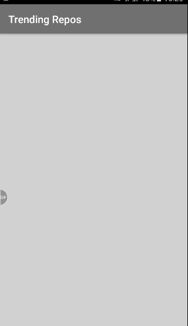

# Android-MVP-GithubApi

A small app based on [MVP (Model View Presenter)](https://en.wikipedia.org/wiki/Model%E2%80%93view%E2%80%93presenter) that will list the most starred Github repos that were created in the last 30 days.

  

## This project uses:
- [Retrofit](http://square.github.io/retrofit/) / [OkHttp](http://square.github.io/okhttp/)
- [Gson](https://github.com/google/gson)
- [Dagger 2](http://google.github.io/dagger/)
- [Butterknife](https://github.com/JakeWharton/butterknife)
- [Picasso](https://github.com/square/picasso)

## Requirements:
- JDK 1.8
- [Android SDK](http://developer.android.com/sdk/index.html).
- [Android 8.0 (API level 26)](http://developer.android.com/tools/revisions/platforms.html).
- Latest Android SDK Tools and build tools.

## Architecture

